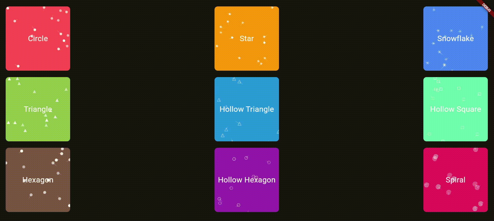

# random_shapes_animator

A fully customizable Flutter package that adds sparkling or animated shapes (like stars, circles, or snowflakes) to your widgets. Perfect for festive UIs, celebration screens, or decorative components. Easily enhance your UI with dynamic, animated elements that are both lightweight and smooth in performance. [Available on pub.dev](https://pub.dev/packages/random_shapes_animator)

[](https://pub.dev/packages/random_shapes_animator)

Made by - [Priyanshu Dutta](https://priyanshudutta.vercel.app/)

## Visual



## How to use

```
RandomShapesAnimator(
  shape: Shape.star,
  child: Text('Hello!'),
)
```

## ✨ Features

- 🌟 Add dynamic shapes like `star`, `circle`, or `snowflake`.
- 🧩 Easily wrap around any widget.
- 🎯 Customizable speed, color, opacity, trail length, and more.
- 🖼️ Adjustable animation area size.
- ⚡ Lightweight and smooth performance.

---

## Properties

| Property       | Type            | Description                                                                                                                                                               |
| -------------- | --------------- | ------------------------------------------------------------------------------------------------------------------------------------------------------------------------- |
| `child`        | Widget          | The widget to be wrapped with the sparkle animation.                                                                                                                      |
| `shape`        | Shape enum      | The shape of the sparkles. Available shapes: `star`, `circle`, `snowflake`, `square`, `hollowSquare`, `triangle`, `hollowTriangle`, `hexagon`, `hollowHexagon`, `spiral`. |
| `motionType`   | MotionType enum | The motion style of the sparkles: `straight`or `sine` (smooth curvy). **Default:** `MotionType.straight`                                                                  |
| `starCount`    | int?            | Number of sparkles. **Default:** 15                                                                                                                                       |
| `maxSpeed`     | double?         | Maximum speed of sparkle movement. **Default:** 0.3                                                                                                                       |
| `trailLength`  | int?            | Length of the trail following each sparkle. **Default:** 10                                                                                                               |
| `areaSize`     | Size?           | The rectangular area within which sparkles move. **Default:** Size(200, 200)                                                                                              |
| `sparkleColor` | Color?          | Color of the sparkles. **Default:** Colors.white                                                                                                                          |
| `minOpacity`   | double?         | Minimum opacity for sparkles. **Default:** 0.5                                                                                                                            |
| `maxOpacity`   | double?         | Maximum opacity for sparkles. **Default:** 1.0                                                                                                                            |

### Installation

Add the following to your `pubspec.yaml`:

```yaml
dependencies:
  random_shapes_animator: ^1.2.0
```
